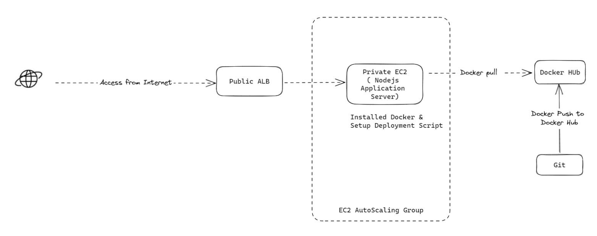

## Node.js application into a Docker container and setup with Autoscaling

### Here's the simple diagram to setup the project

## Task Lists

- Create Dockerfile to run Node.js simple application
- Build your image and push to dockerhub
- Deploy your image on Private EC2 with Autoscaling Group
- Setup Application Loadbalancer on Public Network
- Implementing a continuous integration and delivery (CI/CD) pipeline, This could include setting up automated building and deploying docker image  ( using any tool you prefer )
- Manage and Setup EC2  for this application, using tools such as Ansible or Terraform.

### Optional additions

> setup domain & ssl on Public Application Loadbalancer ( if you have any testing domain )

Remark 
> Make sure the application loadbalancer is reachable from the public internet

> Make sure the Nodejs Server within Autoscaling Group is not reachable from the public internet.

